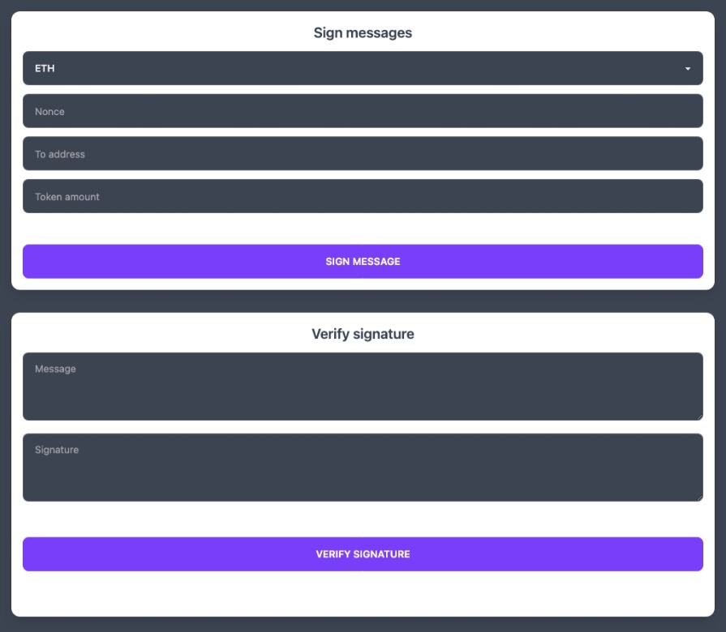

# react-eth-metamask-signatures

- This repository is a fork of [react-eth-metamask-signatures](https://codesandbox.io/s/react-eth-metamask-signatures-ibuxj)

- Additionally, this repository has also been published on [codesandbox](https://codesandbox.io/s/react-eth-metamask-signatures-forked-mvvkxc)

## Starting the Web Application

```shell
% pnpm install
% FAST_REFRESH=false pnpm run start
```



## How to Use the Web Application

- You can generate the data packet (including signer, to, nonce, amount, callData) and the signature using Metamask.

- Afterward, you can deploy the [SignatureDemo.sol](./contracts/SignatureDemo.sol) to [Remix](https://remix.ethereum.org/) and call the executeWithoutNonce() or executeWithNonce() function to recover the signer from the signature, using the provided data packet and signature.

- Note: The [private key](https://github.com/ethereum/remix-project/blob/master/libs/remix-simulator/src/methods/accounts.ts) for the Remix account.

## Considerations when using the SignatureDemo.sol contract

- If you want to transfer ETH (callData.length == 0), you need to transfer an equal amount of ETH to this contract before or at the same time as calling the executeWithoutNonce() or executeWithNonce() functions.

- If you want to transfer USDT (callData.length != 0), you need to transfer an equal amount of ERC20 tokens to this contract before calling the executeWithoutNonce() or executeWithNonce() functions.

- This contract has been deployed to the Sepolia testnet: [0x94524f06ea9355010bf37301015da3f5665bec75](https://sepolia.etherscan.io/address/0x94524f06ea9355010bf37301015da3f5665bec75)

- This contract has been deployed to the Goerli testnet: [0x94524f06ea9355010bf37301015da3f5665bec75](https://goerli.etherscan.io/address/0x94524f06ea9355010bf37301015da3f5665bec75)
